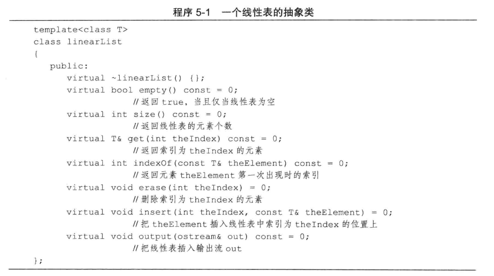

# 线性表

在此文档种，内容包括但不限于：

- 线性表；
- 顺序表；
- 数组；
- 链表；
  - 单链表；
  - 双链表；
  - 循环链表；
- 向量；


在正式介绍内容之前，我们先简单的区分一下线性表，顺序表，链表和数组之间的区别和联系；

线性表是一个抽象的概念，一种逻辑结构，由于其是线性的，故称为线性表。

数组和链表是一种物理结构，一种具体的存储数据的方式，可以用来实现线性表（但也不是只能用来表示线性表）。

顺序表是线性表中的一种，是用数组来实现的线性表，所以其存储结构也是线性的。

大致的关系也可以通过下图来表示：


这章内容正是进入到数据结构的复习当中（好耶），下面捎带一下数据结构和数据对象的内容；


## 数据对象

数据对象是一组实例或值，如下表：

| 对象          | 值                             |
| ------------- | ------------------------------ |
| boolean       | {false, true}                  |
| digit         | {0, 1, 2, 3, 4, 5, ......}     |
| letter        | {A, B, C, ......}              |
| naturalNumber | {0, 1, 2, 3, ......}           |
| integer       | {0, ±1,±2, ±3, ...... }        |
| string        | {a, b,......., aa, bb, ......} |


## 线性表（数组实现）

线性表也被称作有序表，其每个实例都是元素的一个有序集合，实例的表达形式为：$(e_0, e_1, e_2, ......, e_{n - 1})$。

### 顺序表

顺序表：即把线性表的节点按逻辑次序依次的放在一组地址连续的存储单元里。

（即通常用数组进行实现）


#### 方法及时间性能

| function              | runtimes |
| --------------------- | -------- |
| InitList(&L)          | O(1)     |
| ListLength(L)         | O(1)     |
| getElem(L, i, &e)     | O(1)     |
| LocateElem(L, e)      | O(n)     |
| ListInsert(&L, i, e)  | O(n)     |
| ListDelete(&L, i, &e) | O(n)     |

在存储空间中申请空间，即初始化为 O(1)；

对于结构体 List 来说，长度为一个成员变量，故求得数组长度为 O(1)；

通过下标取元素 O(1)；

对于定位元素来说，最好的情况下为 O(1)， 最坏的情况下为 O(N)，没找到情况下也为 O(N)，则查找成功的比较次数 为：
$$
ACN = \frac{1}{n} *(1 + 2 + 3 + 4 + 5 +......n) = \frac{1}{n} * \frac{n * (n + 1)}{2} = \frac{1 + n}{2}
$$
对于插入元素来说，最好的情况是插在末位，其余的元素不用移动位置，O(1)，最坏的情况是插在首位，其余元素均要进行移动， O(n)（这就是后续会引入链表的原因之一）。则插入的平均情况为:

```c
bool ListInsert ( SqList *&L, int i, Elemtype  e )
   {
    //在表中第 i 个位置插入新元素 x 
       if (i < 1|| i >L->length +1|| L->length == MaxSize)
  	  return false;                //插入不成功	
      for (  j = L->length; j > =i; j-- )
            L->data[j+1] = L->data[j];		
       L->data[i] = e;   L->length++;	
       return ture;                //插入成功       
       }
    }

```


$$
AMN = \frac{1}{n + 1}\sum^{n + 1}_{i = 1}(n - i + 1 ) = \frac{1}{n + 1}\frac{n(n + 1)}{2} = \frac{n}{2}
$$


对于元素删除来说，大致与插入元素相同，即影响因素主要是由于元素的位置而导致其他元素挪位的次数。


$$
AMN = \frac{1}{n}\frac{n(n - 1)}{2} = \frac{n - 1}{2}
$$
另外，补充一下线性表抽象类的定义，下图截自《数据结构、算法与应用 c++ 描述》。



其中主要使用了模板(Template)，来避免因不同的使用场合而多次重复定义。

ps:在上述的方法讨论当中，我们均考虑的是**定长数组**，而并未考虑到**动态数组**的情况。如果考虑在动态数组上进行操作，那么数组增加的长度也会是一个影响因素。已知，如果我们总是按一个乘法因子（一般是扩大两倍）来增加数组长度，那么实施一系列线性表的操作所需要的时间与不用改变数组长度时相比，至多只增加一个常数因子。


### 迭代器

暂略。（会在后续部分的指针内容当中提出）


### 向量 (vector)

对于笔者个人来说，向量可以认为是高级版的数组(Array)。若读者你正在向量和数组之间该使用谁还有所取舍，那么看看下列两者的比较：

-  Arrays 具有固定的长度并且很不容易重新改变大小。（对于C++来说，数组甚至不知道自己的 size 是多少）
- 在 C++ 中，当你使用 array 下表越界时甚至没有必要的 crashing 和 warning 来提醒你。
- 数组不支持许多你想要的操作，例如：插入，倒置，排序等。

下面用表格来展示一下 vector 支持的操作：


## 链表

链表的诞生主要是一下几个原因：

- 当某些数据类型进行添加时需要重新调整大小时，进行添加操作十分的 costly。
- 进行插入操作时挪位元素过多，加长了代码的运行时间。

因此，链表采用了将每个元素存储在自己的空间块里面，就可以避免以上两种情况的发生。（当然，也会引出其他的坏处

对于单个节点来说，其主要包括两个部分：1. 数据域：即用来存储数据大小的部分；2. 链域：将各个节点串起来，避免丢失部分节点。


### 循环操作

对于链表的循环，主要通过一个临时指针变量来进行。此处应注意，不可使用头指针或其他部位的指针来进行遍历，否则会造成链表的数据丢失。


### 插入操作

对于插入操作，可大致分为头部插入和尾部插入（？？。

对于**尾部插入数据**，首先是对链表进行遍历，找到需要插入数据的位置，再进行初始化节点，插入数据，将尾指针设为NULL即可。（最后一步比较容易遗忘，需牢记）


当进行头部的数据插入时，指针的交换顺序非常重要！

```c++
temp = new ListNode();
first->next = temp;
temp->next =first ->next;
```


若指针交换顺序如上时，先将头指针指向新节点，则会导致后续的链表数据全部丢失。

正确的顺序应该如下：

```c++
temp = new ListNode();
temp->next = first->next;
first->next = temp;
```


具体方法如下：


### 删除操作

删除操作即删除指定索引的元素。对于这种操作，往往需要多几个心眼（不是），尽量去考虑所有的情况。

- index < 0 或 index > listSize ，则这种情况下删除操作无效，因为无法找到指定的元素。
- 删除非空表的头节点。
- 删除其他元素节点。

另外，显而易见，该操作的时间复杂度是 O(index)。


### 找下标操作

时间复杂度为 O(listSize)，无过多需要阐述的。


### 循环链表

循环链表的大部分结构与单链表相同，唯一不同的一点在于单链表的尾节点指针是 NULL，而**循环链表的尾节点指针则指向头节点**。这样做的目的是为了从任一节点出发都可以访问到链表中的所有节点。


### 带尾指针的链表

从之前的操作可以看出来，当我们进行尾插操作时，需要将整个链表进行遍历，找到最后的位置再进行插入操作。因此为了能够在链表的末端最快的插入一个元素，我们增加一个指针 lastNode，它是指向链表尾节点的指针。（空间换时间）记住在上述的插入、删除操作当中，若涉及到尾部的操作，也需同时修改尾指针。


### 双向链表

在单向链表中，每个节点的指针均指向下一个节点，在双向链表中，节点具有 3 个属性，指向前驱指针，数值，和指向后驱的指针。通常来说，双向链表会采用带头节点的循环链表表示方式。由于多引入了一个前驱方向导致指针数目增多，因此在进行如插入等操作时，操作指针的前后顺序则显得格外重要。


示例操作如下图所示：


在进行操作时，应先将后续的节点接在你要插入的那个节点上（new 节点)，以避免后续数据的丢失。同时确立新节点的前驱节点。总之，**开始的两步操作均对新节点的指针进行设置，而不去打乱原列表的指针。**


删除操作如下：

ps:由于笔者较为懒惰，故能借鉴的地方则借鉴。


### 静态链表和动态链表

略。（个人觉得不是重点


## 总结一下

**在顺序表中**，即可以进行随机存取，也可以进行顺序存取；

**而在链表中**，则只能进行顺序存取。

**对于插入删除操作**，顺序表可能需要移动元素，而链表不需要。

